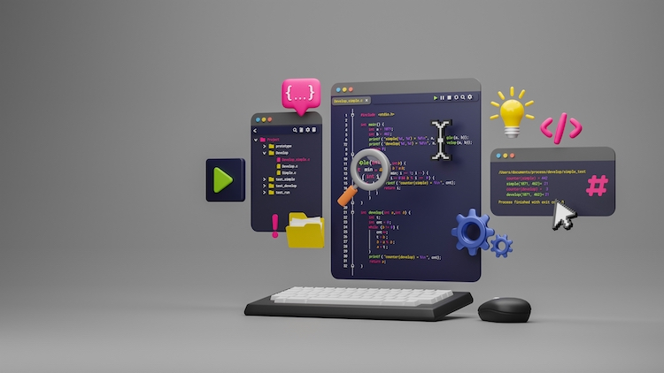

<h1>Olâ eu me chamo Lucas Ferreira Rodrigues 👋</h1>

<h3>- 👩‍💻 Cursando ADS-Análise e desenvolvimento de sistemas no Ifro.</h3>
<h3>- 👨‍🏫 Atualmente estou estudando Front-end.</h3>
<h3>- 🤵 Estágiario da Compass UOL.</h3>

  <a href="https://github.com/lucas-ifro">
  
  
  

 

 
  
 
    
    <h2 align="center">Tecnologia Estudadas</h2>
    
    
    
    
    
    
   

    
  
  <h2 align="center">Redes Sociais</h2>
    
    

 

